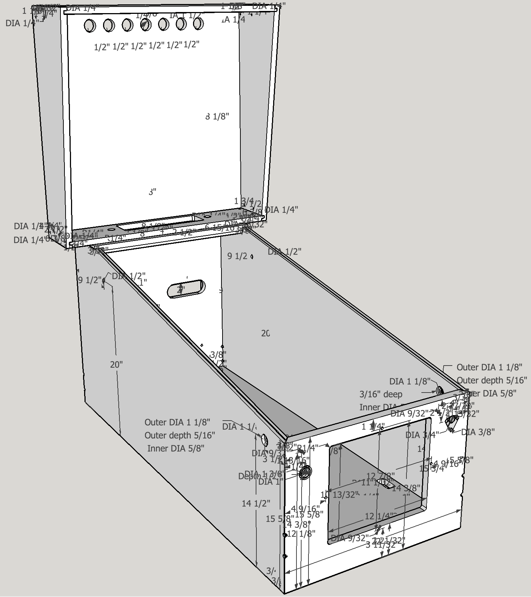
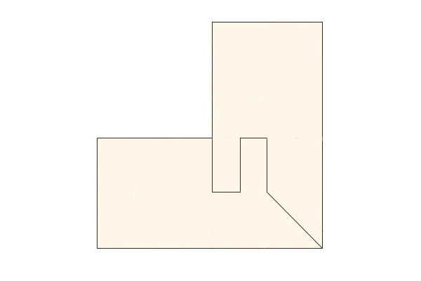

# WPC Pinball Standard Body Cabinet

This repo contains a sketchup model of a pinball cabinet in standard WPC body style and related information. I did this model to have a starting point for designing a virtual pinball cabinet.

To view the model download the [Sketchup Viewer](https://www.sketchup.com/products/sketchup-viewer). To edit the model download [Sketchup Make](https://www.sketchup.com/download?sketchup=make). Both these tools are free.

The sketchup file is [here](https://github.com/jonaskello/wpc-cabinet/archive/0.1.0.zip). You need to unzip it and find the file `wpc_cabinet.skp` and open it in Sketchup or the viewer.

If you find any mistakes in the model or the information below please open a [new issue](https://github.com/jonaskello/wpc-cabinet/issues/new) or make a post in this [thread](http://vpuniverse.com/forums/topic/3281-wpc-standard-body-sketchup/).

Here is a screenshot from the model:

## Notes

* The model is made from measurements taken from my STTNG and IJ widebody games, but converted to standard body width. In addition to taking measurements from the physcial games I cross-checked with information found online which I have listed in [references](#references). Some measurements are only from online sources since they were hard to do without tearing down the games.

* I started out in millimeters but many measurements did not make sense so I switched to inch. To convert to millimeters multiply by 25.4. 

* The sides should have two holes for playfield support screws, but they are different for different playfields (at least my IJ and STTNG have their holes at different places). So those holes are omitted in the model.

* The joints are modelled as simple mitre joint. Both my IJ and STTNG uses "lock mitre joints". See below for more info on joints.

## Material

All components should be made of 3/4" thick birch playwood.

## Cabinet Joints

There are several ways to make the cabinet joints. The original way it was done in WPC cabinets is to use "lock mitre joints" but they require a special routing [bit](https://www.verktygsproffsen.se/produkt/Cobolt-Hornforbindningsfras-med-12-mm-skaft). Newer cabinets like my Stren LOTR uses a simpler joint. Another option is to just make butt joints without any angles, just make sure to adjust the measurements accordingly.

Below is a picuture of a lock mitre joint:

About lock mitre joints, see this [image](references/mitre-lock-joint.jpeg) from this [thread](https://pinside.com/pinball/forum/topic/peanuts-pinball). Also see [this image](http://pinballmakers.com/wiki/index.php/File:Mitre-bit.png) from this [page](http://pinballmakers.com/wiki/index.php/Construction). And [this page](https://howtobuildapinballmachine.wordpress.com/tag/miter-lock/) has some more information.

## Backbox Joints

The backbox joints should be according to the model.

# Components

## Cabinet Left/Right Side

| Cut            | Tool              | Description                        |
|:-------------- |:----------------- |:---------------------------------- |
| Main Height    | 23-1/2"           |                                    |
| Main Width     | 51-1/2"           |                                    |
| Main Slope     | Saw               | Front height 15-5/8. Start 7-1/8" from back. |
| Flipper button | 1-1/8" Drill      | 5/16" deep from outside.           |
| Flipper button | 1-1/8" Drill      | 3/16" deep from inside.            |
| Flipper button | 5/8" Drill        |                                    |
| Backbox hinge  | 1/2" Drill        | 20" from bottom, 1-1/2" from back. |
| Glass channel  | 3/32" slot cutter | 3/8" deep along the slope.         |
| Leg Bolt From  | 3/8" drill        | Two holes, 2 1/4 apart, in 45 degree angle.                |
| Leg Bolt Back | 3/8" drill        | Two holes, 2 1/4 apart, in 45 degree angle.                |
| Bottom joint   | 3/4" router       | 1/4" deep. 3/8" from bottom.  |

## Cabinet Front

| Cut            | Tool              | Description                        |
|:-------------- |:----------------- |:---------------------------------- |
| Main Height    | 15-3/4" / 15-5/8" | Bevel cut 10 degrees. Outside height 15-5/8". |
| Main Width     | 22"               |                                    |
| Bevel top      | Saw               | Cut to outside height 15-5/8".     |
| Start button   | 1-3/8" drill      | 1/2" deep from outside.            |
| Start button   | 1" drill          |                                    |
| Coindoor       | 1/4" router       | Rectangular, 12-1/4" width, 10-13/32" height. |
| Coindoor       | 9/32" drill       | Two holes centered on left/right edge, width 12-7/8 between centers. |
| Coindoor       | 9/32" drill       | Two holes, centered on top/bottom edge, height 11-1/32" between centers. |
| Lockdown bar   | 9/32" drill       | Center 14-3/8" from bottom, 4" from right edge.     |
| Lockdown bar   | 9/32" drill       | Center 14-3/8" from bottom, 1-13/16 from left edge.     |
| Plunger        | 3/4" drill        | One hole.                  |
| Plunger        | 3/8" drill        | Three holes.                  |
| Plunger        | 3/8" router       | Cut between the holes.                  |
| Leg Bolt Left  | 3/8" drill        | Two holes, 2 1/4 apart, in 45 degree angle.                |
| Leg Bolt Right | 3/8" drill        | Two holes, 2 1/4 apart, in 45 degree angle.                |
| Bottom joint   | 3/4" router       | 1/4" deep. 3/8" from bottom.  |

## Cabinet Back

| Cut            | Tool              | Description                        |
|:-------------- |:----------------- |:---------------------------------- |
| Main Height    | 23-1/2"           |                                    |
| Main Width     | 22"               |                                    |
| Vent #1        | 1" Drill          | Two holes.                         |
| Vent #1        | Router            | Rectangular width 6", height 2".   |
| Vent #2        | 1" Drill          | Two holes.                         |
| Vent #2        | Router            | Rectangular width 6", height 2".   |
| Power cord     | 2-1/2 Drill       |                                    |
| Power cord     | 5-1/16 Drill      | Four holes.                        |
| Leg Bolt Left  | 3/8" drill        | Two holes, 2 1/4 apart, in 45 degree angle.                |
| Leg Bolt Right | 3/8" drill        | Two holes, 2 1/4 apart, in 45 degree angle.                |
| Bottom joint   | 3/4" router       | 1/4" deep. 3/8" from bottom.  |

## Cabinet Top

| Cut            | Tool              | Description                        |
|:-------------- |:----------------- |:---------------------------------- |
| Main Height    | 7-1/8" / 7"       | Bevel cut 10 degrees. Inner height 7". |
| Main Width     | 22"               |                                    |
| Backbox cables | 1/4" Router       | Rectangular width 8-1/8", height 3-1/8". |
| Backbox nut #1 | 15/32" Drill      |                          |
| Backbox nut #2 | 15/32" Drill      |                          |
| Left joint     | >=3/4" Router     | 3/8 deep from bottom.       |
| Right joint    | >=3/4" Router     | 3/8 deep from bottom.       |

## Cabinet Bottom

| Cut            | Tool              | Description                        |
|:-------------- |:----------------- |:---------------------------------- |
| Main Height    | 50-1/2"           |                                    |
| Main Width     | 21"               |                                    |
| Speaker        | 5-1/2 hole saw    |                                    |
| Vent #1        | 1-1/2" drill      |                                    |
| Vent #2        | 1-1/2" drill      |                                    |
| On/Off switch  | 1/4" Router       | Rectangular width 2-1/4", height 1-1/8". |

## Backbox Left/Right Side

| Cut            | Tool              | Description                        |
|:-------------- |:----------------- |:---------------------------------- |
| Main Height    | 28-1/2"           |                                    |
| Main Width     | 9-7/8"            |             |
| Main Slope     | Saw               | Botttom width 6-3/8".              |
| Bottom bracket | 1/4" Drill        | Two holes, 2-1/2" apart.           |
| Top bracket    | 1/4" Drill        | Two holes, 3" apart.               |
| Top joint      | 3/8" Router       | 3/8" from top. 3/8" deep.          |
| Bottom joint   | 3/8" Router       | 3/8" from bottom. 3/8" deep.       |
| Back joint     | >=3/4" Router     | 3/8" from back. 3/8" deep.         |

## Backbox Back

| Cut            | Tool              | Description                        |
|:-------------- |:----------------- |:---------------------------------- |
| Main Height    | 28-1/8"           |                                    |
| Main Width     | 28"               |                                    |
| Vent           | 1-1/2 Drill       | Seven holes, 2-1/2 between centers.|

## Backbox Top

| Cut            | Tool              | Description                        |
|:-------------- |:----------------- |:---------------------------------- |
| Main Height    | 9-7/8"            |                                    |
| Main Width     | 28"               | Front bevel cut 7 degrees.         |
| Left joint     | >=3/4" Router     | 3/8" from top. 3/8" deep.          |
| Right joint    | >=3/4" Router     | 3/8" from top. 3/8" deep.          |
| Back joint     | >=3/4" Router     | 3/8" from bottom. 3/8" deep.       |
| Left bracket   | 1/4" Drill        | Two holes, 2" apart. 1-1/2" from back. |
| Right bracket  | 1/4" Drill        | Two holes, 2" apart. 1-1/2" from back. |

## Backbox Bottom

| Cut            | Tool              | Description                        |
|:-------------- |:----------------- |:---------------------------------- |
| Main Height    | 5-23/32"          | Front bevel cut 7 degrees. Bottom height 5-5/8". |
| Main Width     | 28"               |          |
| Left joint     | >=3/4" Router     | 3/8" from bottom. 3/8" deep.       |
| Right joint    | >=3/4" Router     | 3/8" from bottom. 3/8" deep.       |
| Backbox nut #1 | 1" Drill          |                          |
| Backbox nut #2 | 1" Drill          |                          |
| Backbox cables | 1/4" Router       | Rectangular width 11-1/2", height 3-1/4". |
| Left hinge bracket | 1/4" Drill    | Three holes, 1-3/4" apart. 1/2" from back. |
| Right hinge bracket | 1/4" Drill    | Three holes, 1-3/4" apart. 1/2" from back. |

# References

The files from these references are avaialble in the [references](references) folder.

Mameman pinball [plans](http://vpuniverse.com/forums/topic/171-plans-williams-widebody-cabinet-plans/).

Some nice CAD drawings in this [thread](https://pinside.com/pinball/forum/topic/bally-wms-cabinet-designs-help-needed).

Plunger drilling [template](http://mjrnet.org/pinscape/plunger-drilling.html).

Buttons hole [drilling](http://www.vpforums.org/index.php?showtopic=28014).

Playfield rear plastic [trim](http://www.marcospecialties.com/pinball-parts/03-8091).

Glass channel [tools](http://www.vpforums.org/index.php?showtopic=27208).

Coin door [measurements](http://www.actionpinball.com/pics/coindoor1_specs.gif).
